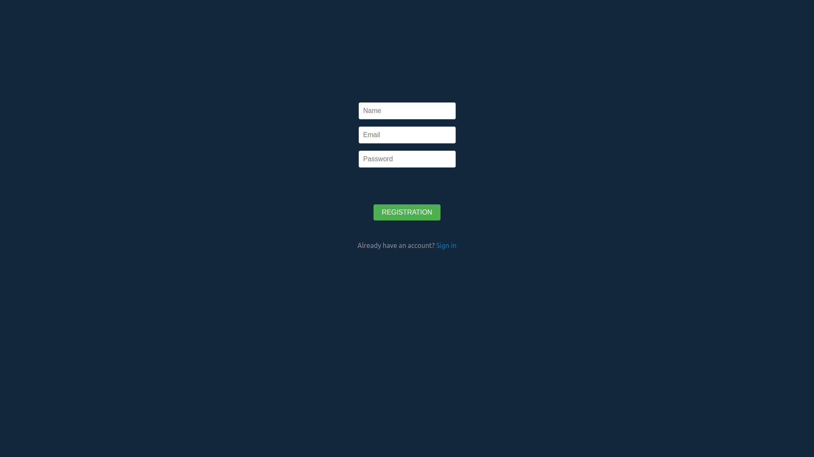
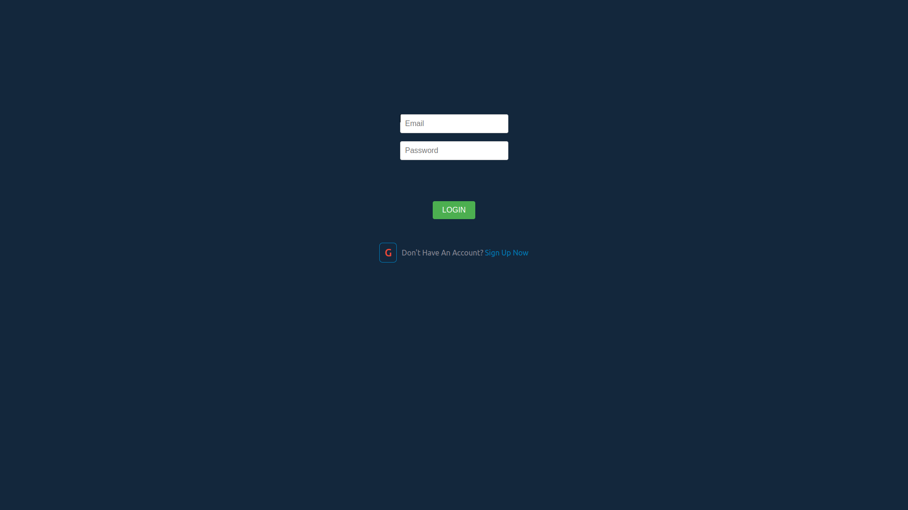
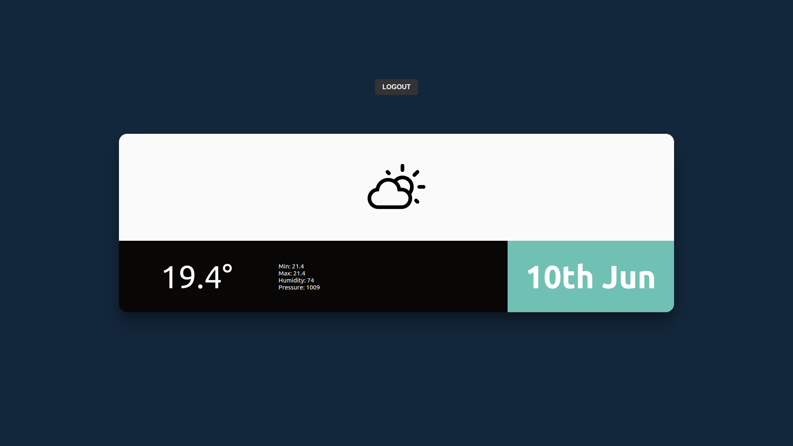

<p align="center"><a href="https://laravel.com" target="_blank"></a></p>

## Technologies used:
### Back-end
____

1. firebase/php-jwt for generate token
2. guzzlehttp/guzzle for http
3. stevebauman/location to get coordinates
4. laravel/socialite for Google auth
5. Redis
6. MySQL

### Front-end
____
1. React
2. axios for requests
3. public-ip to get ip

### Requirements
____
1. Run the command in the directory where you want to clone the project:
   ```
   git clone https://github.com/LeonidioPerfavore/rezet-test-task.git
   ```

2. Create an .env.example file in the root directory and rename it to .env:
   ```
   cd rezet-test-task
   cp .env.example .env
   ```
3. Add the URL to the APP_URL environment variable to run locally, you can leave the current one
4. JWT_SECRET_KEY can be replaced at will (this is a random string; it is unnecessary to get it anywhere)
5. In the external directory, change .env.example to .env and add the internal URL (APP_URL) to the REACT_APP_BACKEND_URL environment variable.
   ```
   cd frontend/
   cp .env.example .env
   ```
7. Set up google account to receive: GOOGLE_CLIENT_ID & GOOGLE_CLIENT_SECRET
   you will need to create a project in the Google Cloud Console and set up your credentials to use the Google API https://console.cloud.google.com
8. Get API_KEY for weather service: https://openweathermap.org/ for filling OPEN_WEATHER_API_KEY

## Installations
____

### via docker
Run commands:
1. Specify environment variable DB_HOST=mysql
   You can use the MySql database created when starting the container by specifying: DB_DATABASE=testing
   Or create your own.
   DB_USERNAME= ,
   DB_PASSWORD= fill in these variables when starting the docker container they will create a user automatically with this password
2. Specify environment variable REDIS_HOST=redis

3.
```
docker run --rm
-u "$(id -u):$(id -g)"
-v $(pwd):/opt
-w /opt
laravelsail/php80-composer:latest
composer install --ignore-platform-reqs
```

4.
```
./vendor/bin/sail up
```
5.
```
./vendor/bin/sail artisan key:generate
```
6.
```
./vendor/bin/sail artisan migrate
```

### via composer & npm

1. Create mysql DB:
  ```
   CREATE DATABASE dbname;
   CREATE USER 'username'@'localhost' IDENTIFIED BY 'password';
   GRANT ALL PRIVILEGES ON dbname.* TO 'username'@'localhost';
   FLUSH PRIVILEGES;
  ```
2. 
  ```
   composer install
  ```
3.
  ```
   php artisan serve
  ```
3.
  ```
   php artisan key:generate
  ```
4.
  ```
   php artisan migrate
  ```
5. Go to frontend directory & run command:
  ```
   npm install
  ```
6.
  ```
   npm start
  ```

PS: redis-server & MySQL server must installed & running

## Description

There is an api written in Laravel and a UI written in React
At the api/register registration endpoint, a user is created and a JWT token is issued.


In case of successful registration, you can log in with his credentials via the /api/login route.


You can also sign in with your google account. When you click on the G icon, the following backend will happen, we will return redirects to the google login form and when choosing an account, we will go to the api/google/login endpoint
on which the user will be created if it did not exist before and the jwt token will be issued.
Endpoint /api/home searches for weather data by user id; if there is no data (they are stored for 1 hour), a request is made to a third-party server to obtain weather data.



## Tests
Run command:

  ```
   php artisan test
  ```
OR
  ```
   ./vendor/bin/sail artisan test
  ```